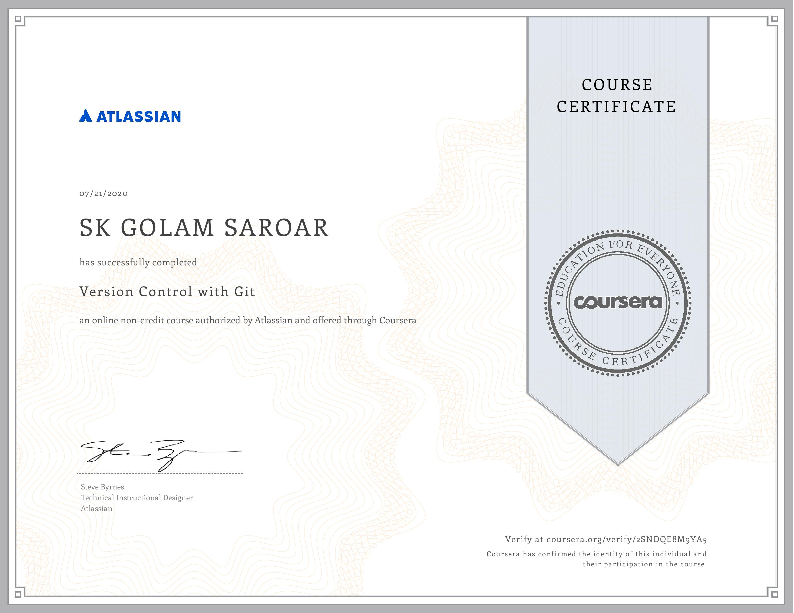

## Version Control with Git

This repository contains the resources and my notes from the Coursera course [Version Control with Git](https://www.coursera.org/learn/version-control-with-git).  

These [labs](/labs) are excellent resources for hands-on practice. [Video lectures](/lectures) from the course have also been added to this repository.

This is a very handy [Git cheatsheet](git-cheatsheet.pdf) from Atlassian. Also, I have added my [notes](version-control-with-Git.pdf) and [slides](version-control-with-Git.pptx).  

Here is my certificate from the course: 

Finally, this is a great [tutorial](https://www.atlassian.com/git) on Git.
